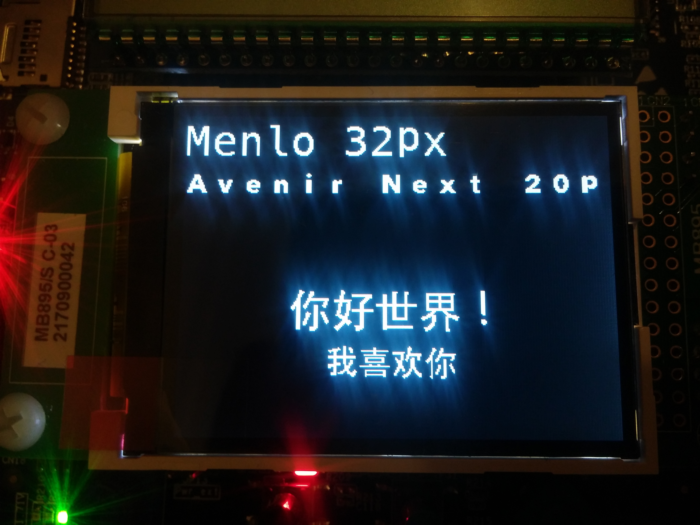

# STM32-LCD_Font_Generator

> Generate C source text fonts for STM32Cube Fonts Utilities Driver.
> 
> For use with the BSP LCD driver for STM32xx-EVAL boards.

--- 

## Examples of generating fonts

***Refer to this project: [TFT-CustomFonts](https://github.com/zst-embedded/STM32L073VZT6-Learning_Projects/tree/master/projects/TFT-CustomFonts)***

### Monospace fonts

    cd example
    python3 ../stm32-font.py --font Menlo.ttc --size 32

### Proportional font

*Proportional fonts will have monospace-style spacing*

    cd example
    python3 ../stm32-font.py --font 'Avenir Next.ttc' --size 20

### Other charsets

*Example shown is having chinese charsets*

    cd example-chinese
    python3 ../stm32-font.py -f 'STHeiti Medium.ttc' -s 24 -c chinese-hello-world.txt 
    python3 ../stm32-font.py -f 'STHeiti Medium.ttc' -s 32 -c chinese-hello-world.txt 

--- 

## Adding fonts into project

### Fixing the BSP library (Part 1)

The main code for drawing chars on the LCD is inside `stm32l073z_eval_lcd.c` via the `LCD_DrawChar` function.
In the function, the font bytes are converted into a bitmap. However, the bitmap has a max size.

    #define MAX_HEIGHT_FONT         17
    #define MAX_WIDTH_FONT          24

    /* Max size of bitmap will based on a font24 (17x24) */
    static uint8_t bitmap[MAX_HEIGHT_FONT*MAX_WIDTH_FONT*2+OFFSET_BITMAP] = {0};

This means that that beyond 408 bytes (17x24), the fonts are not displayed at all.
For a simple fix, we can add the `bitmap` array locally in the function which has a dynamic size.

    static void LCD_DrawChar(uint16_t Xpos, uint16_t Ypos, const uint8_t *pChar)
    {
      // ADDED
      uint8_t *bitmap = calloc(DrawProp.pFont->Height * DrawProp.pFont->Width*2 + OFFSET_BITMAP, sizeof(uint8_t));

      /* Original Code */

      // ADDED
      free(bitmap);
    }

### Fixing the BSP library (Part 2)

Another issue is that when generated font uses more than 3 bytes per row, the fonts will not display at all again.

    if(((width + 7)/8) == 3)
    {
      line =  (pchar[0]<< 16) | (pchar[1]<< 8) | pchar[2];
    }
    
    if(((width + 7)/8) == 2)
    {
      line =  (pchar[0]<< 8) | pchar[1];
    }
    
    if(((width + 7)/8) == 1)
    {
      line =  pchar[0];
    }   

This is because it is hardcoded for 1 to 3 bytes. 

`line` is little-endian swapped order of `pchar` 
Replace it with this which works for any number of bytes

    int bytes = ((width + 7)/8);
    line = 0;
    for (int i = 0; i < bytes; i++) {
        line <<= 8;
        line |= pchar[i];
    }

---

***The changes are done accordingly in [`stm32l073z_eval_lcd_new.h`](stm32l073z_eval_lcd_new.h). Copy it into the project***

### Additional Unsolved Bugs

1. if the width of the character exceeds 32 pixels or 32 bits, the font will be cut off to the left.

